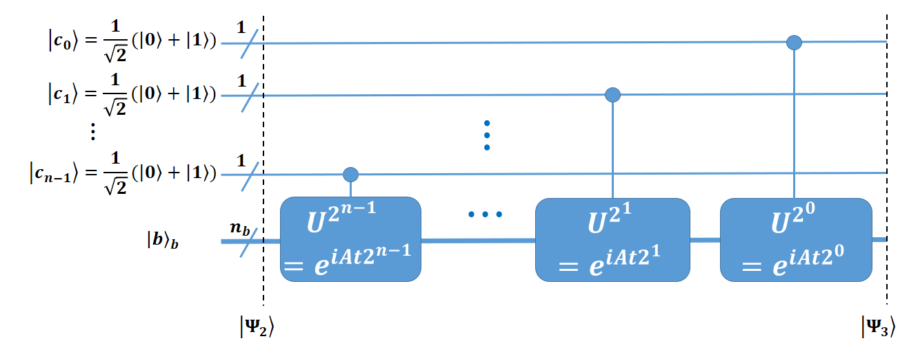

# HHL Algorithm Implementation in Qiskit

## Introduction

This document provides a step-by-step implementation of the HHL algorithm using Qiskit. The algorithm is broken into four key phases:

1. **State Preparation**
2. ***Quantum Phase Estimation (QPE)**
3. **Controlled Rotation & Measurement of the Ancilla Qubit**
4. **Uncomputation (Inverse QPE)**

```{python}
#| echo: false
#| output: false

# Import necessary libraries
import qiskit
import numpy as np
from numpy import pi
from qiskit import QuantumRegister, QuantumCircuit, transpile
from qiskit_aer import Aer
from qiskit.circuit.library import UnitaryGate, QFT
from scipy.linalg import expm

# previous functions
def state_prep(mat_A, vec_b, n_c=1):
  N_b = vec_b.shape[0]
  n_b = int(np.log2(N_b))
  qr_b = QuantumRegister(n_b, name='qr_b')  # b-register
  qr_c = QuantumRegister(n_c, name='qr_c')  # c-register
  qr_a = QuantumRegister(1, name='qr_a')    # a-register
  qc = QuantumCircuit(qr_c, qr_b, qr_a)  # complete circuit

  norm_b = vec_b / np.linalg.norm(vec_b)
  qc.initialize(norm_b, qr_b)
  return qc, qr_b, qr_c, qr_a
```

### Numerical Example
$A=\begin{bmatrix}1 & -\frac{1}{3}\\-\frac{1}{3} & 1\end{bmatrix}$  
$\vec{b}=\begin{bmatrix}0\\1\end{bmatrix}$

### Variables
$n_b$: # of qubits in `b-register` 

$N_b=2^{n_b}$: # of unknows (length of $\vec{b}$, $len(\vec{b})=len(\vec{x})$)

$n_c$: # of qubits in ``c-register``

a larger $n_c$ results in higher accuracy when the encoding is not exact 

$N=2^n$ 

$t=\frac{\pi}{8}$: time variable, choose $t$ such that $\tilde{\lambda_j}=\frac{\lambda_jt}{2\pi}$ is an integer

```{python}
N_b = 2 # number of variables (b.shape[0])
n_b = int(np.log2(N_b)) # number of qubits in b-register
# n_b = 1 # N_b = 2^(n_b), n_b = np.log2(N_b)
n_c = 1 # number of qubits in c-register
N_c = 2 # N_c = 2^(n_c)
t = np.pi/8
```

## Phase 2: Quantum Phase Estimation
The Goal for this phase is to estimate the eigenvalues of given Matrix.

### Step 1. Superposition of the Clock Qubits (`c-register`) through Hadamard gates
$$
\begin{align}
|\psi_2\rangle &= I^{\otimes n_b}\otimes H^{\otimes n}\otimes I |\psi_1\rangle \\
&= |b\rangle\frac{1}{2^\frac{n}{2}}(|0\rangle+|1\rangle)^{\otimes n}|0\rangle \\
&= |b\rangle\frac{1}{\sqrt2 ^n}(|0\rangle+|1\rangle)^{\otimes n}|0\rangle
\end{align}
$$

其实就是每个state in `c-register` 都apply Hadamard gate (变成$\frac{1}{\sqrt2}(|0\rangle+|1\rangle)$)
$\frac{1}{\sqrt2 ^ n}$ 是因为$H^{\otimes n_c}|0\dots0\rangle_c$

```{python}
mat_A = np.array([[1, -1/3], [-1/3, 1]])
vec_b = np.array([0,1])
psi_1, qr_b, qr_c, qr_a = state_prep(mat_A, vec_b, n_c=1)
psi_2 = psi_1.copy()
psi_2.h(qr_c)
psi_2.draw(output='mpl')
```

### Step 2. Controlled Rotation
Apply the control-$U$ operation such that the eigenvalues of `A` would be stored in `register-C`.
$$
U = e^{iAt}
$$
Where $t$ is the time. **E.g.** a state $|\psi\rangle$ would be $e^{iAt}|\psi\rangle$ after time $t$.

We want to apply the control-$U$ operation such that $U|b\rangle = e^{2\pi i \phi}|b\rangle$, where $e^{2\pi i \phi}$ is the eigenvalue of `A` ($A|\phi\rangle=e^{2\pi i \phi}|\phi\rangle$), esitmated from $U^{2r}, U=e^{iAt}$. Where $r$ is the index of the clock qubit (`c-register`).


When the control clock qubit is $|0\rangle$, $|b\rangle$ will not be affected. If the clock bit is $|1\rangle$, $U$ will be applied to $|b\rangle$. This is equivalent to multiplying $e^{2\pi i \phi 2^j}$ in front of the $|1\rangle$ of the j-th clock qubit $|c_j\rangle$. (notice the $U^{2^r}$ and $U^k$ ahead, here $2j=2r$ or $2j=k$)

##### Controlled Rotation 总结
1. 受控 $U^{2^j}$ 操作的目的是把 $e^{i\lambda_i \phi}$ 编码到控制寄存器，通过 QFT 解析出 $\lambda_i$ 的相位信息。
2. $e^{iAt}$ 是时间演化矩阵，而我们希望将其转换成 $e^{2\pi i \phi}$， 使得 QFT 可以处理相位信息并测量出 $\phi$。
3. 指数幂次 $U^{2^j}$ 的目的是让相位信息能以足够高的分辨率存入控制寄存器，从而精确估计 $\lambda_i$。
4. 最终，$\lambda_i=\frac{2\pi\phi}{t}$，通过控制寄存器的测量结果 $\phi$ 来反推出 $\lambda_i$。

after controlled-$U$ operation, we have
$$
|\psi_3\rangle=|b\rangle\otimes\frac{1}{\sqrt2 ^n}~~~(|0\rangle+e^{2\pi i \phi 2^{n-1}}|1\rangle)\otimes(|0\rangle+e^{2\pi i \phi 2^{n-2}}|1\rangle)\otimes\dots~~~\otimes(|0\rangle+e^{2\pi i \phi 2^{0}}|1\rangle)\otimes|0\rangle_a
$$
$$
|\psi_3\rangle=|b\rangle \frac{1}{\sqrt2 ^n}\sum\limits^{2^{n}-1}_{k=0}e^{2\pi i \phi k}|k\rangle |0\rangle_a
$$


```{python}
U = expm(1j * t * mat_A)
U_gate = UnitaryGate(U, label="e^\{iAt\}")
controlled_U = U_gate.control(1)  # controled gate by |1⟩
psi_3 = psi_2.copy()
for j in range(n_c):
    power = 2**j  # U^{2^j}
    controlled_U_pow = U_gate.power(power).control(1)  # 计算 U^{2^j} 并加控制
    psi_3.append(controlled_U_pow, [qr_c[j], *qr_b])


psi_3.draw(output='mpl')
```


### Step 3 inverse quantum Fourier transform (IQFT)
Apply IQFT, only clock qubits (`c-register`) are affected.

$$
\begin{align}
|\psi_4\rangle &= |b\rangle\text{IQFT}(\frac{1}{\sqrt2 ^n}\sum\limits^{2^{n}-1}_{k=0})|0\rangle_a\\
&=|b\rangle\frac{1}{\sqrt2 ^n}\sum\limits^{2^n-1}_{k=0}e^{2\pi i \phi k}(\text{IQFT}|k\rangle)|0\rangle_a\\
&=|b\rangle\frac{1}{\sqrt2 ^n}\sum\limits^{2^n-1}_{k=0}e^{2\pi i \phi k}(\sum\limits^{2^n-1}_{y=0}e^{-2\pi iyk/N}|y\rangle)|0\rangle_a\\
&=\frac{1}{\sqrt2 ^n}|b\rangle\sum\limits^{2^n-1}_{y=0}\sum\limits^{2^n-1}_{k=0}e^{2\pi i k (\phi-y/N)}|y\rangle|0\rangle_a
\end{align}
$$

only $|y\rangle$ satisfying the condition $\phi-y/N=0$ will have a finite amplitude of $\sum\limits^{2^n-1}_{k=0}e^0=2^n$ otherwise the amplitude is $\sum\limits^{2^n-1}_{k=0}e^{2\pi ik(\phi-y/N)}=0$. After ignoring the states of zero amplitude  

$$\begin{align}
|\psi_4\rangle&=\frac{1}{\sqrt2 ^n}|b\rangle\sum\limits^{2^n-1}_{k=0}e^{2\pi ik.0}|N\phi\rangle|0\rangle_a\\
&=|b\rangle|N\phi\rangle|0\rangle_a
\end{align}
$$  

Therefore, in QPE, the clock qubits are used to represent the phase information of $U$, which is $\phi$, and the accuracy depends on the number of qubits, $n$.

To understand why the c-register is called the clock qubits and the meaning of t better, it is worth noting that the Hamiltonian of a system in quantum mechanics determines how a system evolves through the following equation,$U=e^{iAt}$, and $t$ can be treated as the evolution time for that Hamiltonian. 

$U$ is also diagonal in $A$′s eigenvector, $|u_i\rangle$, basis. If $|b\rangle=|u_j\rangle$.$U|b\rangle=e^{i\lambda_jt}|u_j\rangle$. 

let $i\lambda_jt=2\pi i \phi$, we get $\phi=\frac{\lambda_j t}{2\pi}$, and
$$
|\psi_4\rangle=|u_j\rangle|\frac{N\lambda_jt}{2\pi}|0\rangle_a
$$  

So far, we have assumed that $|b\rangle$ is an eigenvector of $U$,$|u_j\rangle$. In general, $|b\rangle$ can be expressed as a superposition of $|u_j\rangle$.
$$
|\phi_4\rangle=\sum\limits^{2^{n_b}-1}_{j=0}|b_j\rangle|u_j\rangle|\frac{N\lambda_jt}{2\pi}|0\rangle_a
$$

choose $t$ so that $\tilde{\lambda_j}=\frac{N\lambda_jt}{2\pi}$ are integers, therefore, $\tilde{\lambda_j}$ are usually scale of $\lambda_j$  

$|\psi_4\rangle=\sum\limits^{2^{n_b}-1}_{j=0}b_j|u_j\rangle|\tilde{\lambda_j}|0\rangle_a$  

```{python}
iqft = QFT(num_qubits=n_c, do_swaps=False).inverse()  # 创建 IQFT 门
psi_4 = psi_3.copy()
psi_4.append(iqft, qr_c)  # 作用在 c-register 上

psi_4.draw(output='mpl')
```

### All in one function
```{python}
def phase_estimation(qc, qr_b, qr_c, mat_A, t):
    n_c = len(qr_c)
    
    # 1. Hadamard on c-register
    qc.h(qr_c)
    
    # 2. Apply controlled-U^(2^j) operations
    U = expm(1j * t * mat_A)  # 计算 e^(iAt)
    U_gate = UnitaryGate(U, label="e^{iAt}")  # 创建 U gate
  
    for j in range(n_c):
        power = 2**j  # 计算 U^(2^j)
        controlled_U_pow = U_gate.power(power).control(1)  # 控制操作
        qc.append(controlled_U_pow, [qr_c[j], *qr_b]) 
    
    # 3. Apply IQFT on c-register
    iqft = QFT(num_qubits=n_c, do_swaps=False).inverse()
    qc.append(iqft, qr_c)  # 作用于 c-register
    
    return qc

mat_A = np.array([[1, -1/3], [-1/3, 1]])
vec_b = np.array([0,1])
t = np.pi/8
psi_1, qr_b, qr_c, qr_a = state_prep(mat_A, vec_b, n_c=1)


psi_4 = phase_estimation(psi_1, qr_b, qr_c, mat_A, t)

psi_4.draw(output='mpl')
```

prev [State Preparation](./hhl_imp1.html)  
next step is [Controlled Rotation](./hhl_imp3.html)
